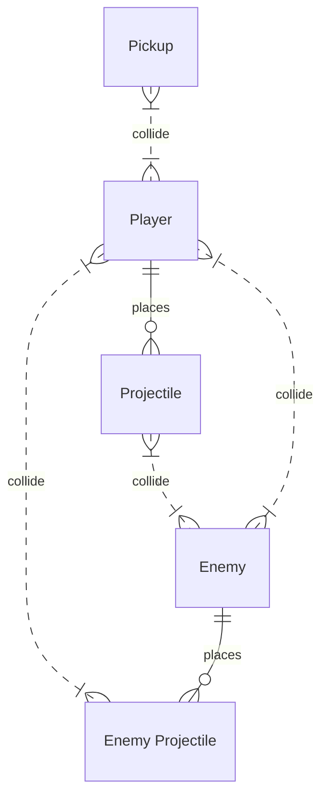

# 摘要

在这一章，你将制作一个街机风格（arcade-style）的相扑游戏，游戏的目标是将移动越来越复杂的敌人撞落漂浮大陆，在力量提升的帮助下打败它们。通过创作这个原型，你将学习如何向项目中添加新的玩法机制，包括能够让游戏更加有趣的规则或系统。一方面，你会学习如何编写力量提升，使得玩家获得短暂的优势。另一方面，你会让敌人的移动越来越复杂，使得玩家更难存活。力量提升和难度提升的良好平衡可以让游戏体验更加美好。

> 导入Gameplay Mechanic


# Watch Where You're Going

在最开始，我们会创建一个新的原型项目，并下载原始文件。你会注意到文件中有美丽的小岛、天空和粒子效果——这些都可以被定制！接着你将赋予玩家按照将相机围绕小岛旋转到合适角度的能力，使得玩家能够有更好的视野。玩家将扮演一个包裹着特定纹理的小球。最后，你将给玩家施加作用力，使得玩家可以在相机方向上前后移动。

**目标**：相机能够响应玩家的水平方向输入，绕小岛中间的特定点旋转。玩家可以控制一个有着特定纹理的小球，在朝向特定点的方向上前后移动。


## 设置玩家并添加一个纹理

1. 在层级中新建一个Sphere，重命名为Player
2. 修改Scale为1.5
3. 添加Rigidbody组件
4. 在Library > Textures里面，选一个材质添加给小球。


## 为相机创建一个焦点（Focal Point）

1. 创建一个空对象，重命名为Focal Point
2. 重设位置，将相机设置为这个空对象的子对象
3. 创建Scripts文件夹
4. 创建RotateCamera脚本，应用到FocalPoint上


## 根据用户输入转动焦点

1. 编写代码，根据rotationSpeed和horizontalInput旋转相机
2. 调整旋转速度。


## 为玩家添加向前的力

1. 创建PlayerController脚本，应用到Player上。
2. 声明`public float speed`并初始化
3. 声明`private Rigidbody playerRb`，在Start()中初始化
4. 在Update()方法中，接收VerticalInput
5. 调用playerRb.AddForce()，为小球添加移动的力。


## 沿着焦点方向移动

1. 声明`private GameObject focalPoint`，在Start()中初始化。

2. 在AddForce中，使用focalPoint.transform.forward，获取焦点的local前向量

   > 这个方法也可以用于敌人发射投射物时的导航。


# Follow the Player

玩家现在已经可以随心所欲地滚动了，但还缺少一个目标。在这节课中，我们会通过创建敌人，给玩家创造挑战，弥补玩家缺少的目标。首先我们会为敌人附加选择的纹理，然后赋予敌人弹飞玩家的能力——这可能将玩家撞下边界。最后，我们会让敌人追踪玩家，并在随机位置生成。

**目标**：在游戏开始的时候，小岛上会生成带有纹理的球形敌人，生成位置由一个随机函数决定。这个敌人会追踪玩家，将玩家撞下边界。


## 添加敌人和物理材质

1. 创建新的sphere，重命名为Enemy，添加一个材质
2. 添加Rigidbody，调整缩放为1.5
3. 创建Physics Materials文件夹，创建新的Physics Material，命名为Bouncy
4. 调整Bouncy的属性。


## 创建敌人脚本，使其追踪玩家

1. 创建Enemy脚本

2. 声明`Rigidbody enemyRb; GameObject player; public float speed;`

3. 在Start()中初始化enemyRb和player

4. 在Update()方法中，用AddForce添加enemy朝向玩家的力

   > 因为这个力是使用两点position相减计算的，为了防止力的大小随着两者距离发生变化，需要先将向量归一化（normalized）


## 创建lookDirection变量

整理代码，使用lookDirection变量存储enemy的移动方向。


## 创建Spawn Manager

1. 将enemy创建为prefab
2. 创建SpawnManager对象和脚本
3. 声明`public GameObject enemyPrefab`，将预制体分配给接口
4. 在Start()方法中，使用Instantiate在特定位置生成enemy


## 在随机位置生成敌人

1. 在SpawnManager中，使用Random函数获得随机位置
2. 将这个位置存储为randomPos变量，传入Instantiate函数


## 用一个方法封装位置计算

返回值为Vector3

```c#
private Vector3 GenerateSpawnPosition()
    {
        float spawnX = Random.Range(-spawnRange, spawnRange);
        float spawnZ = Random.Range(-spawnRange, spawnRange);

        Vector3 spawnPosition = new Vector3(spawnX, 0, spawnZ);
        return spawnPosition;
    }
```


# PowerUp and CountDown（coroutine）

敌人会在小岛上追踪玩家，而玩家也需要能够抵御敌人的方式——尤其是在添加了更多敌人之后。在这节课，我们将创建powerup，能够暂时提升玩家的力量，从而将撞过来的敌人打飞。powerup会在随机的位置生成，并在玩家拾取到的时候，在玩家身上显示一个高光提示。powerup物体和高光的种类将由玩家决定。

**目标**：powerup会在地图随机的位置生成，等待玩家拾取。当玩家和powerup碰撞的时候，powerup会消失，而玩家会被高光指示。powerup会在拾取后持续5秒，让玩家有强大的力量能够击飞敌人。


## 选择并准备一个powerup

1. 在Library中拖入一个Powerup对象进入场景，重命名为Powerup
2. 添加Box Collider，应用Is Trigger
3. 创建Powerup tag并应用
4. 创建为Prefab


## 在碰撞的时候销毁Powerup

1. 在PlayerController中编写OnTriggerEnter()
2. 添加if语句来销毁Powerup对象
3. 声明`public bool hasPowerup`为后面处理powerup下的碰撞做准备。


## 测试敌人和powerup（啊，我想到了，应该译成强化）

1. 创建Enemy Tag，应用到Enemy 预制体上
2. 在PlayerController脚本中，添加OnCollisionEnter()函数
3. 使用if语句检测碰撞对象的Tag是否为Enemy，以及玩家是否处于PowerUp状态。


## 在强化状态下，添加额外的冲击力

1. 修改前面的检测代码，声明变量存储敌人的Rigidbody
2. 用坐标相减的方式，获取击飞方向向量
3. 使用AddForce(,impulse)击飞敌人。


## 为强化创建计时流程

1. 创建`IEnumerator PowerUpCountDownRoutine(){}`

   > 这个枚举器在此提供计时功能

   ```c#
   IEnumerator PowerUpCountDownRoutine()
       {
           yield return new WaitForSeconds(powerupTime);
           hasPowerup= false;
       }
   ```

2. 在拾取强化道具的那一段逻辑里，加上`StartCoroutine(PowerUpCountDownRoutint())`


## 为强化添加视觉指示

> 使用gameObject.SetActive()方法来更改指示标记的可见性。

1. 添加一个指示物，重命名为Power Indicater，调整大小

2. 取消勾选名称前面的对勾，设置Active为false，使得该指示物不可见

   

3. 在PlayerController脚本中，声明`public GameObject powerupIndicator`，编辑器内传引用

4. 当玩家拾取强化的时候，设置Active为true；当失效的时候，设置为false

5. 在Update()方法中，使用玩家的位置更新指示物的位置，使得指示物可以跟随玩家移动

   > 这里不将指示物作为玩家子物体移动的原因是，本原型中玩家移动使用的是AddForce，小球是会滚动的，如果指示物作为玩家的子物体，则指示物也会跟着滚动。


# For-Loops For Waves（循环和变化）

我们已经拥有了一个很不错的游戏所需要的一切；玩家可以四处滚动，旋转视角，拾取强化获得力量，敌人可以持续追踪玩家，直到发生撞击。在这个教程中，我们会将这些部分组合起来，形成一个完整的游戏。

> wrap up：包裹，组合起来；使……顺利结束

首先，我们需要调整下spawn manager，使得它可以生成多个敌人，并在每波（wave）敌人结束的时候增加生成的数量。最后，我们会在每波生成强化道具，使得玩家可以回击不断变多的敌人。

**目标：**

spawn manager将每波执行一次，生成多个敌人和一个强化道具。每当敌人数量只剩0个的时候，就会开启新的波次。


## （自己做的一点补充）加个碰撞面用来删除掉到平台下面的敌人

1. Create Empty，添加个Mesh Collider，设定mesh为plane；设置为Trigger


2. 创建脚本Destory Plane，编写OnTriggerEnter()方法，用CompareTag判断是否为Enemy，调用Destory删除。

   


## 编写for循环来生成三个敌人

1. 在`SpawnManager.cs`中，用for循环改写Instantiate()方法。
2. 创建一个新的函数`SpawnEnemyWave(int wave)`，使得代码可以复用

```c#
void SpawnEnemyWave(int wave)
    {
        for (int i = 0; i < wave; ++i)
        {
            Instantiate(enemyPrefab, GenerateSpawnPosition(), enemyPrefab.transform.rotation);
        }
    }
```


## 在敌人跌落平台的时候销毁敌人

这个我做了，实现方式不太一样，教程在Enemy的Update()方法中每帧检测一次y，我感觉我的方法更好些？


## 在没有敌人的时候开启下一波

1. SpawnManager的Update()方法中，检测Enemy的数量，使用`FindObjectsOfType<Enemy>().Length`

> 我没用这个方法，我直接用的进程间通信，DestoryPlane销毁Enemy的时候调用SpawnManager的方法修改spawnCount，在spawnCount归零的时候重新生成。


## 在不同波次之间增加难度

```c#
private int waveHard = 1;
void Update()
    {
        if(spawnCount == 0)
        {
            ++waveHard;
            SpawnEnemyWave(waveHard);
        }
    }
```


## 在新的波次生成powerup

```c#
public GameObject powerupPrefab;
void Update()
    {
        if(spawnCount == 0)
        {
            ...
            SpawnPowerupWave(waveHard / 2);
        }
    }
void SpawnPowerupWave(int wave)
    {
        for(int i = 0; i < wave; ++i)
        {
            Instantiate(powerupPrefab, GenerateSpawnPosition(), powerupPrefab.transform.rotation);
        }
    }
```


# 挑战4：足球脚本

在全新的场景——足球运动中，应用你在上个原型中学到的知识。和上个原型一样，你需要通过旋转相机控制小球，向小球施加前进的力，有所不同的是，这次你需要在对手射门前，将球撞进对手的球门。同样的，在每轮结束的时候，你需要生成新的敌人小球，再次抵御敌人。然而，项目中的绝大部分功能都还没有实现，需要由你来给出正确的实现。

你将迎接以下挑战：

- 敌人会冲向你的球门，你可以把它们撞开
- powerup可以赋予你5秒中的力量增强
- 当没有敌人的时候，开启新的一轮


## Warning

当你导入挑战项目的时候，应该会有很多bug。

这些bug会在下面列出，你需要修复这些bug；如果你卡在了某个地方，最底部有提示。

如果你没法修复这些bug，并且想要删除挑战项目文件，右键Asset > Delete即可。

加油！


## 当你撞上敌人的时候，敌人会冲向你

估计是enemy脚本的问题，向量可能算反了？


确实反了的样子，enemy应该向着远离player的地方移动，因此player是向量起点，enemypos - playerpos.


## 玩家拾取powerup的时候会开启新波次

检查下SpawnManager吧


enemyCount()计数的问题。


## powerup不会消失

他说的是强化效果不会消失，需要5秒后就消失的。


这个协程（Coroutine）没被调用。

我们直接在拾取powerup的代码段中开始协程就可以


## 每波只生成两个敌人

看一眼SpawnManager

for循环的问题


改成传入的参数就可以


## 敌人不会移动

看一眼Enemy，代码好像没啥问题


控制台提示，NullReference，大概率是没找到对象

检查一下Prefab


哦，我明白了，没给playerGoal赋值


另外enemy的速度没设置，所以也没法跑


## 玩家需要加速能力

当玩家按下空格的时候，玩家可以加速，并且有加速特效。

1. 设置一个特效，在按下空格的时候，SetActive()
2. 通过`hasSpeedup`判断是否需要设置加速


## 敌人的速度应该随着波次缓慢增加

进程间通信，SpawnManager每次调用一次Enemy就可以。

需要注意的是，不断变动的速度值应该存储在SpawnManager，而不是Enemy，因为后者只有生成敌人的时候才会创建，存储在后者中会导致无法正确更新speed的初始值；或者说，速度值会在多次游戏之间累加。

> 简而言之，Manager这种始终存在于场景中的才适合作为存储对象。


# Lab 4 - 基础游戏机制

在这个lab中，你将使用所有的非玩家对象，通过建立基础的游戏机制，让你的游戏活起来。

你将创建投射物、掉落物或者敌人的基础移动和碰撞检测，将这些对象转换为预制体，并在spawn manager中随机生成这些对象。

完成这个lab之后，你的游戏应该已经初具核心机制了。

**目标**：

在场景中的合适位置生成可以移动的非玩家对象。并在对象和其他对象碰撞的时候，发生如你预想的反馈，例如奖励或者破坏。


## 让对象可以移动

1. 必要的话，给对象添加Rigidbody组件
2. 创建新脚本，并将脚本绑定到对象上
3. 编写对象的基本移动，并测试代码。

我的构想是用transform移动，对象初始化一个speed和direction，从而确定移动方向。


## 在对象离开屏幕的时候销毁

1. 可以创建新脚本，也可以向已经存在的脚本中添加代码

先直接在Movement中实现吧？

还是写个专门的Script比较好，方便后面修改功能


投射物最开始考虑用协程写个计时器，后来想了想，enemy的投射物也需要调用这个，不如也用边界框了（偷懒）

no，不能偷懒，还是把enemy和player的投射物做个区分比较好


## 处理碰撞

首先对Tag进行分类：

- Enemy
- Player
- Pickup
- Projectile
- Enemy Projectile

考虑需要处理的碰撞情况

- Player
  1. Enemy
  2. Pickup
  3. Enemy Projectile

- Enemy
  1. Projectile
  2. Player
- Pickup
  1. Player
- Projectile
  1. Enemy
- Enemy Projectile
  1. Player



### Player

1. Enemy

   如果是敌人的话，Player和Enemy的health都要减少

   可能存在碰撞伤害速度过快的问题，不过吃亏的一般是Player，不改了

2. Pickup

   因为两种pickup不同，所以从pickup中处理Collide更合理些？

   > 不用了，还是在PlayerController里面吧，因为OnTriggerEnter需要带刚体

3. Enemy Projectile

   直接调用Projectile.Damage()，削减生命值并销毁投射物即可


### Enemy

1. Player

   已经处理过了

2. Projectile

   需要有一边加刚体来处理碰撞

   修改下enemy的模式吧，用一个baseEnemy作为origin，从这个基类衍生其他的enemy


### Pickup

因为设定了两种pickup，需要分别实现

1. Heal

   捡到Heal的时候，增加`healNum`的血量（不同player的回性不同？）

2. Powerup

   还没想好怎么强化，先处理碰撞和销毁。


两种投射物已经处理过了。


## 将对象转换成预制体

1. 创建Prefabs文件夹
2. 将对象拖入文件夹中
3. 删除场景中的对象
4. 将对象拖入场景中进行测试。


## 创建SpawnManager

1. 创建空对象，重命名为SpawnManager
1. 创建GameObject数组存储prefab
1. 使用Instantiate()，Random.Range()，InvokeRepeating()方法来随机生成对象
1. 将游戏导出并保存。


## 射击子弹

1. 使用Instantiate()来生成子弹
2. 我想用类似花映冢的射击思路，在按下z的时候射出一组子弹
3. 两次按键之间需要有时延，这里可以用Coroutine来实现；具体来说，通过在协程里面维护一个bool来确定是否可以射击。
4. 射击多个角度的子弹可以采用for循环，这貌似是非常常用的方法了。首先预设一个弹幕扩散角，然后计算出弹幕的角度，并使用`Quaternion.Euler()`将欧拉角转换为四元数，使用`instantiate()`方法生成弹幕。
5. 在同一个方向上射击多个子弹可以采用在该方向上增加偏移的方式，首先使用4中计算出的旋转矩阵，计算出旋转后的z正向（transform.rotation * rotate * Vector3.forward），然后，使用for循环控制偏移


## Powerup机制的实现

在射击方式已经确定的基础上，powerup机制设计为：增加子弹数量，增加扩散角度


修改Enemy的部分代码，在Enemy的HP归0的时候生成powerup


由于我们使用碰撞检测敌人是否被击中，因此可能出现复数子弹同时集中敌人使其死亡的情况，此时会多次调用spawnPowerup，可以加个bool检查；只有活着的敌人才会生成powerup


## Shift减速的时候，让弹幕集中

我们此前已经编写过Shift减速的方法了，在这里加修改fireSpread的方法就行

和修改speed一样，为了防止出现在减速的时候拾取powerup导致不该有的bug，用一个新变量存储实际的spread


使用GetKey代替GetKeyDown()，保证在减速状态下，火力升级不会使弹幕扩散。


## 调整判定点，使其更符合原作

1. 将collider mesh的半径调小为0.2（原本是0.5)

2. 新建一个球Hit point，变为Player的子对象

3. 在按下shift的时候调整外圈球的透明度；这里穿插一点Renderer和Material的知识

   同一个Renderer组件下可以存在多个Material组件，可以用`GetComponent<Renderer>`调用Renderer组件，并使用`.material`来调用Material组件。

   当Renderer中存在多个Material的时候，应该使用`.materials`来获取组件数组，并使用数组下标获取对应的material。

   

   > 同一个Renderer下面看可以存在多个Materials

   

   修改materials中某个材质的值不会在原材质上造成改变，需要通过赋值的方式来进行修改。

   ```c#
   Material[] materials = gameObject.GetComponent<Renderer>().materials;
   Color color = materials[0].color;
   color.a = 0.5f; // 设置透明度为0.5
   materials[0].color = color;
   gameObject.GetComponent<Renderer>().materials = materials;
   ```

   在我们这个场景中，只有一个材质，因此可以直接修改color

   > 这种修改方法要求材质的渲染模式（Renderer Mode）必须设置为Transparency（透明度）或Fade，Fade的效果好像更适合当前场景？
   >
   > 

   **实际上实现出来的效果不是很理想，先不做这个修改比较好。**


# 额外功能4 - 分享你的作品

在这个教程中，你可以继续巩固你学习到的知识，并将你的作品分享给其他创作者。

教程提供4项额外功能，分别评级为简单、中等、困难和专家。你可以自由选择这些功能，根据自己的理解实现，然后分享你的作品。

这个教程是可选的，但强烈推荐那些想要提升自己的技能水平的人尝试。


## 总览

教程列出了4项值得探究的功能，并根据实现难度做出了分级：

- 简单：更强的敌人
- 中等：带追踪的导弹（从示例视频来看，是个道具）
- 困难：更好的道具
- 专家：Boss战

简单和中等功能可以用本节课学习到的技能完成，但困难和专家的功能需要你多做探索。

因为这个教程是可选的，你可以选择不实现，实现全部或者选择一部分实现。

你同样可以加入自己的功能。

在教程的最后，你将有机会分享你的作品。

我们强烈推荐你不停Google和试错实现这些功能，但是你如果真的卡住了，最底部会有一些提示和逐步教程来帮助你。

加油！


## 简单：更强的敌人

添加一种更强的敌人，并随机选择出现哪种敌人。

从示范的视频来看，应该是让这个敌人的击退能力更强。因为这个敌人速度不是很快，只是在发生碰撞的时候猛地把玩家击退。

我的理解是，从原始的敌人prefab派生出一个prefab，然后添加一个击退脚本？

1. 首先拉一个原始的敌人prefab到场景，给这个敌人添加新的材质

   

2. 创建HarderEnemy脚本，用类似powerup的机制，在这个小球和玩家发生碰撞的时候，让它对玩家施加一个反向的力。

   

3. 保存为新的Prefab，设置为变体

   

4. 调整SpawnManager脚本
   - 修改enemyPrefab为enemyPrefabs数组，
   - 使用Random.Range(0, enemyPrefabs.Length)随机选取敌人。

到此这个功能实现完成。


## 中等：追踪导弹

创建一种新的强化道具，使得玩家能够发射投射物击退敌人（或者在强化生效期间能够自动向各个方向发射投射物）

从示例视频的实现上来看，是间隔一段时间发射和敌人数量相等的子弹，每个子弹追踪一个敌人，子弹撞到敌人后消失，并将敌人击退。

1. 选择新的指示物，拖入场景中

   

2. 给这个指示物添加box Collider，设置IsTrigger

   

3. 创建Fire tag，添加给指示物

4. 创建Fireup脚本，添加给Player

5. 编辑Fireup脚本，使用协程控制脚本延迟时间，考虑使用for循环，每个循环发射一次子弹，循环结束后设置hasFire为false（好像不用这个判定也可以）

   发射子弹的部分先用Debug.Log()代替，先测试协程框架

   

6. 编写发射子弹的逻辑，因为想让子弹有追踪能力，所以应该让子弹能够记录敌人GameObject？

   发射子弹考虑先搜索所有的Enemy对象，形成一个数组，然后逐对象发射子弹。

   

7. 为玩家设置Fireup指示标，和Powerup一样，开始协程的时候SetActive(true)，结束协程的时候SetActive(false)

   在Update()方法中，设置Powerup跟随玩家

8. 将FireIcon转为Original Prefab，记得把position调0

9. 创建Bullet对象，用一个圆柱体代替，稍微转个方向

10. 创建BulletMove脚本，应用给Bullet

    对子弹来说，使用translate可能更好一些。

    > 这里突然注意到前面的撞击处理没给方向向量加.normalized，重新加上。

    子弹移动仍然采用计算方向向量，然后朝敌人移动的方式。

    生成子弹后需要让子弹确定追踪哪个敌人。编写一个SetEnemy()方法，供生成时调用。

    为了方便测试，先设置target为Player

    因为在旋转子弹上面临了许多困难（主要是因为创建的Capsule尖端是朝上的，想让尖端朝向玩家，需要计算旋转，实现这个出现了很多问题）。最终采取的方案是，首先旋转Capsule，然后用一个空GameObject作为父物体，脚本添加在父物体上，相当于修改了模型朝向。

    和new bing讨论的过程中产出了两种修改方向的方法：

    - 使用transform.LookAt(Transform target)
    - 计算lookDirection，设置Rotation

    以及之前所学到的两种移动方法：

    - 使用Translate()
    - 使用AddForce()

    方法各有千秋，根据需要进行使用即可。

    

    

11. 将Bullet转成Prefab

12. 处理玩家发射子弹的逻辑

    在Fireup脚本中，传入Bullet Prefab，使用Instantiate()生成对象，并调用SetEnemy方法设置子弹要追踪的敌人。

    发现不能处理子弹和敌人的碰撞，尝试将collider移动到外层父物体上。

    调整子弹的速度和撞击力度。并在撞击时销毁子弹。

    还需要实现的部分是，当目标敌人消失的时候，需要销毁子弹或者让子弹更改目标（重点在于如何检测敌人已经消失），和new bing 讨论的结果，因为执行Destroy()后，指向该对象的引用会被赋值为null，可以使用`target == null`或者`ReferenceEquals(target, null)`来判断target是否被销毁；但这里存在一个小陷阱，赋值为null是下一帧才能被检测到的，因此在同一帧，如果先执行Destroy，再执行Bullet脚本中的如下代码

    ```c#
    void Update()
        {
            // if target enemy is destroyed, change target
            // Debug.Log(targetEnemy);
            if (targetEnemy == null)
            {
                GameObject[] currentEnemys = GameObject.FindGameObjectsWithTag("Enemy");
                if(currentEnemys.Length > 0) { targetEnemy = currentEnemys[0]; }
                else { Destroy(gameObject); }
            }
            else
            {
                // Use LookAt method to modify direction
                transform.LookAt(targetEnemy.transform);
                // move forward
                transform.Translate(transform.forward * moveSpeed * Time.deltaTime);
            }
            
        }
    ```

    就会导致`the object of type 'GameObject' has been destroyed but you are still trying to access it.`报错，即代码进入了else分支，执行LookAt方法试图访问targetEnemy已经被销毁的空间。在上面的代码中，最开始被注释掉的Debug.Log(targetEnemy)阴差阳错地解决了问题，似乎是因为Debug.Log()使得代码在下一帧，也就是targetEnemy被赋值为null后才执行`if(targetEnemy == null)`从而避免了访问已经销毁的空间。

    这个问题，可以通过严格规定Bullet必须在DestroyPlane脚本之前执行来解决，在菜单栏，Edit > Project Settings > Script Execution Order中，点击`+`先后添加BulletMove和DestroyPlane脚本，从而规范两者的执行顺序（记得Apply）。此时注释掉Debug.Log(targetEnemy)，不会出现报错。

    > 这次的问题说明了规范脚本执行顺序的重要性，尤其是需要在其他脚本中检测Destroy()事件这种极易溢出的情况，一定要合理规范脚本执行顺序。让所有访问引用的脚本，在销毁引用对象的脚本之前执行。

    现在，看起来发射子弹的逻辑已经可以正常运行了，试着激活SpawnManager测试一下

13. 修改SpawnManager，随机生成Fireup或者Powerup道具

    

14. 功能正确执行，大功告成。

> 根据12的经验，同样修改了下enemy脚本中获取Player的位置的代码，因为Player被销毁后，残留的enemy也会访问Player的空间
>
> 


## 困难：粉碎冲击

使用一个新的powerup，player能够跳起来，冲撞地面并击飞附近的敌人。理想情况下，敌人离得越近，受击越强。

1. 选择pickup，拖入场景中，重命名为smash

2. 添加Box Collider，Iso视角检查是否匹配

3. 创建Smash脚本，创建Smash tag，应用到指示物上，将脚本赋给Player

4. 写个协程控制定时

   ```c#
   IEnumerator SmashCoolDown()
       {
           yield return new WaitForSeconds(10);
           Debug.Log("Smash Power Faded!");
       }
   ```

5. 新建变量`smashTime`, `smashIndicator`，选择一个能力生效指示标（偷个懒，直接把瓶子立头顶算了），通过`SetActive`设置标记显示。同时让指示标随着小球移动

   ```c#
   smashIndicator.transform.position = transform.position + new Vector3(0f, 1.2f, 0f);
   ```

6. 实现跳跃逻辑，首先获取空格输入，这里设空格；创建`rb`和`hasJump`，设置`hasJump`防止左脚踩右脚上天。当玩家撞上地面的时候，设置`hasJump = false`

   ```c#
   void Update()
       {
           // get jump Input
           if(!hasJump & Input.GetKeyDown(KeyCode.Space))
           {
               rb.velocity = Vector3.zero;
               rb.AddForce(new Vector3(0, 10, 0), ForceMode.Impulse);
               hasJump = true;
           }
       }
   private void OnCollisionEnter(Collision collision)
       {
           if(collision.collider.CompareTag("Land"))
           {
               hasJump = false;
           }
       }
   ```

7. 实现冲击逻辑，对一定距离内的敌人造成冲击，可以先获取场景内的所有敌人，然后对`smashRange`内的敌人`AddForce`，该逻辑应该在落地的时候触发

   ```c#
   private void OnCollisionEnter(Collision collision)
       {
           if(hasJump && collision.collider.CompareTag("Land"))
           {
               hasJump = false;
               // smash enemies in range
               GameObject[] enemies = GameObject.FindGameObjectsWithTag("Enemy");
               for(int i = 0; i < enemies.Length; i++)
               {
                   Vector3 direction = enemies[i].transform.position - transform.position;
                   if (direction.magnitude < smashRange)
                   {
                       Rigidbody enemyRb = enemies[i].GetComponent<Rigidbody>();
                       enemyRb.velocity = Vector3.zero;
                       enemyRb.AddForce(direction.normalized * smashPower, ForceMode.Impulse);
                   }
               }
           }
       }
   ```

   顺带调整了下敌人的运动逻辑，因为之前的设计没改y值，敌人可以跟着飞

   ```c#
   enemyRb.AddForce(new Vector3(lookDirection.x, 0, lookDirection.z) * speed);
   ```

8. 声明`hasSmash`，只有当该变量为true的时候才能够对敌人产生冲击，顺带为了让跳跃速度更快，通过Constant Force组件给Player增加了`10`的向下力

   

   推导一下，假设此前的向下的力为f，根据动量方程
   $$
   Ft = mv
   $$
   Impuse方法相当于直接加一个速度上去，t和m都是1，因此F变为2倍时，v也应该变为两倍，才能维持原有的高度

   不过之前的高度有点高，微调了一下之后设为了15。

9. 细微调整后，将Smash拾取物创建为Prefab，调整SpawnManager，引入新的拾取物。整理测试区。开发完毕。

   

   


